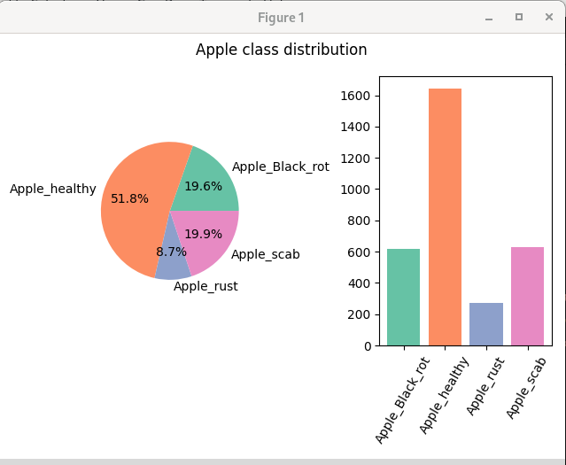
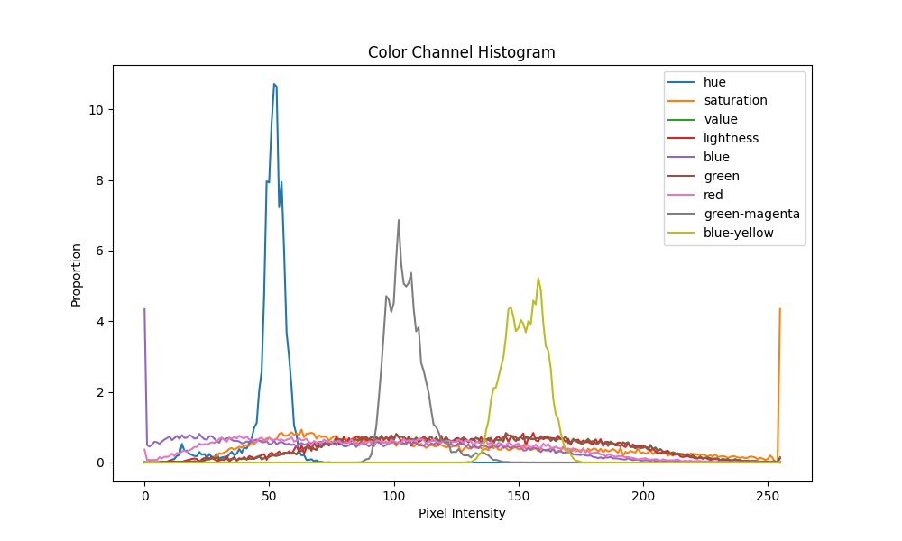
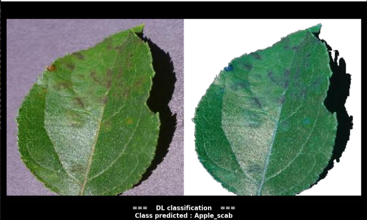

# Leaffliction

## About the project

**Leaffliction** is a 42Network computer vision project designed to classify leaf images as either healthy or affected by a disease. The project is structured into 4 parts : data analysis, data augmentation, data transformation and classification.

## Table of contents

- [About the project](#about-the-project)
- [Getting Started](#getting-started)
- [Usage](#usage)
- [Dataset](#dataset)
- [Model](#model)
- [Ressources](#ressources)

## Getting Started

1. Clone the repository

```python
git clone git@github.com:Tonio2/Leaffliction.git
```

2. Create a virtual environment 

```
python3 -m virtualenv venv
. venv/bin/activate
```

3. Install requirements in virtual environment

```
pip install -r requirements.txt
```

## Usage

### Part 1: Analysis of the Data Set

```
curl <https://cdn.intra.42.fr/document/document/17547/leaves.zip> --output ~/goinfre/file
unzip ~/goinfre/file -d ~/goinfre
python Distribution.py <dirname>
```

### Part 2: Data augmentation

To augment a single image or a directory
```
python Augmentation.py <img_path | dir_path>
```

### Part 3: Image transformation
To transform a single image or a directory
```
python Transformation.py <img_path | dir_path>
```
### Part 4: Classification
Fruit = "Grape" or "Apple"
```
python train.py <dirname>
python predict.py python predict.py <image_path> <model_path> <Fruit> <label_file_path> <output_path>
```
## Dataset

The first three parts of the project emphasize the importance of our dataset choice.

First, we use data visualization to check the quality of our dataset and spot potential imbalance.



We artificially expand our original dataset through augmentation.py (adding noises, adjusting luminosity, rotate, flip, etc). 

Introducing more diversity in the dataset **improves overall performance** and prevents **overfitting problem** (poor generalization to new unseen data).

In the third part, we apply several transformation on our image through transformation.py in order to extract the meaningful data from the input.


In the fourth part, we also normalize our data prior sending it to the model, by dividing images pixel by 255, scaling them between 0 and 1.

We also produce a color histogram to emphasize which channels are relevant.



```python
# in Train.py 
def normalize_img(images):
    """ Normalize image pixel values to the range [0, 1] """
    return np.array(images, dtype="float32") / 255.0
```

## Model

Our model is a neural network. It is structured into 3 main parts : **Encoder, Classifier** and **Optimizer**. The **input** is a leaf image. The expected **output** is a vector of 4 values,  each representing the probability of the input to belong to each class. We then select the class with the highest probability as the prediction.

More about neural networks : https://en.wikipedia.org/wiki/Neural_network_(machine_learning)

**Encoder**

First, our model extracts meaningful features from the input (leaf image) to detect patterns, edges, textures and other relevant characteristics from the image. This is done through several layers: 

- **Convolutional** layer : detects the features.
- **Pooling** layer : focus on meaningful features
- **Dropout** layer : set some random neurons at zero to prevent overfitting

```python
# train.py : build_model()

keras.layers.Conv2D(filters=32, kernel_size=(3,3), padding="same", activation="relu"),
keras.layers.MaxPooling2D(2,2),
keras.layers.Dropout(0.3),
```

Our **activation function** is the **RELU**. (remplace les resultats negatifs par zero. )

More about RELU here : https://en.wikipedia.org/wiki/Rectifier_(neural_networks)

```python
# train.py : build_model()

keras.layers.Flatten(),
keras.layers.Dense(128, activation="relu"),
keras.layers.Dropout(0.5),
```

The **output** of the encoder is a set of feature maps representing the most meaningful information extracted from the input.

**Classifier**

Then, from the encoder’s output, the classifier makes the prediction.

Our classifier uses **Binary Cross-Entropy (BCE)** as the loss function. In our case, BCE determines the probability of the input to belong to each of our four classes. 

The **output** of the classifier is a vector of 4 values,  each representing the probability of the input to belong to each class.

**Optimizer**

Finally, we use the algorithm **Adaptative Moment Estimation (ADAM)** to adjust the model’s weights in order to minimize the BCE loss.

More about ADAM here : https://keras.io/api/optimizers/adam/

**Output**




## Meet the Dream Team 🌱✨
This project wouldn't have been possible without an incredible team effort!
Here's the squad that made it happen:

-[Antoine](https://github.com/Tonio2)
-[Lisa](https://github.com/LDuheron)


## RESSOURCES

- Open cv documentation : https://docs.opencv.org/4.x/index.html
- Plantcv documentation : https://plantcv.readthedocs.io/en/stable/
- Keras documentation : https://keras.io/guides/